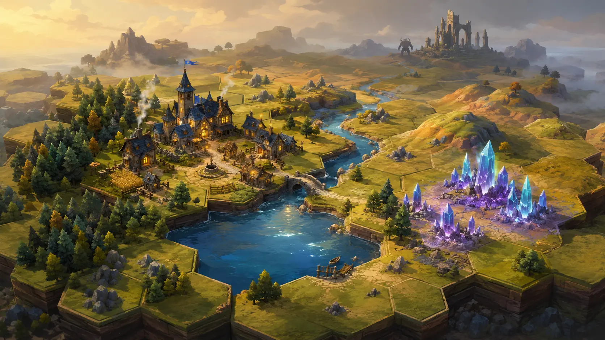

# Aetherfall Realms



Aetherfall Realms is a compact, original fantasy civilization strategy game for desktop and mobile browsers. A match lasts 30 rounds: explore a seeded hex world, found settlements, grow an economy, research a small discovery web, reshape terrain with magic, face monsters and outscore a rival realm.

This repository is a polished vertical slice. It deliberately favors a complete, legible core loop over a sprawling technology tree or premature online infrastructure.

## Playable features

- Deterministic 12×10 axial hex map with eight terrains and fog of war
- Single-player against a command-driven rival AI or two-player local hot-seat
- Scouts, guardians, rangers and adepts with quick deterministic combat forecasting
- Settlements, outposts, automatic nearby-tile working, growth and one construction queue
- Six terrain-sensitive buildings and four recruitable troop groups
- Eight discoveries across Craft, Lore and Arcana
- Five visible map spells: Far Sight, Verdant Bloom, Frostway, Cinder Scar and Soul Beacon
- Ruins, villages, shrines, monster lairs and the rare Skyglass Spire landmark
- Patrolling/chasing monsters that strengthen during the match
- 30-round score victory using population, territory, discoveries, relics, landmarks, monsters and settlements
- Autosave, manual local save, and portable JSON export/import
- Responsive mouse, keyboard and touch controls
- Installable PWA with offline asset caching
- GitHub Pages deployment through GitHub Actions

## Play

Select **New solo realm** or **Local hot-seat** and optionally replace the seed. Identical seeds produce identical starting worlds.

1. Select one of your banner miniatures.
2. Select an adjacent hex and confirm the move in the context panel.
3. Use a scout to found a settlement for 10 materials or an outpost for 6.
4. Select a settlement to queue a building or troop group.
5. Choose a discovery from the top bar; up to 6 stored knowledge is invested at each turn end.
6. Select an army, choose a spell, select a target within three hexes, and confirm.
7. Explore world sites from their hex. Monster lairs must be cleared first.
8. Finish with the highest score after round 30.

Desktop controls: drag to pan, wheel to zoom, click to select, `E` to end the turn, `R` for discoveries, `S` for saves, and `Esc` to cancel. Mobile uses one-finger pan, pinch zoom, large targets and a bottom information sheet.

## Local development

Requires Node.js 22 or newer.

```bash
npm install
npm run dev
```

Open the local URL shown by Vite. The deterministic rule tests and production build are:

```bash
npm test
npm run build
npm run preview
```

To reproduce the exact GitHub project-page base locally:

```bash
VITE_BASE_PATH=/aetherfall-realms/ npm run build
```

## Deploy to GitHub Pages

The workflow at `.github/workflows/deploy.yml` tests, builds and deploys every push to `main`. It derives the project-page base path from the repository name, so no hard-coded repository URL is required.

1. Create an empty GitHub repository, for example `aetherfall-realms`.
2. Connect and push this local repository:

   ```bash
   git remote add origin https://github.com/<username>/aetherfall-realms.git
   git push -u origin main
   ```

3. In **Repository settings → Pages**, select **GitHub Actions** as the source if GitHub has not selected it automatically.
4. Watch the **Test, build and deploy** workflow. The site will appear at `https://<username>.github.io/aetherfall-realms/`.

The app has one document route, so browser refreshes do not require an SPA fallback. The service worker precaches the page, code, icons and title art after the first successful visit.

## Project map

```text
src/game/          deterministic state, rules, AI, data and persistence
src/scenes/        Phaser map rendering and input
src/styles/        responsive HTML interface
tests/             deterministic engine and save-format tests
docs/              architecture and asynchronous multiplayer plan
public/assets/     production art and PWA icons
.github/workflows/ test/build/Pages deployment
```

Read [Architecture](docs/ARCHITECTURE.md) for the state transition model and [Online Multiplayer](docs/ONLINE_MULTIPLAYER.md) for the Supabase-ready design.

## Current vertical-slice limits

- The rival AI is intentionally tactical and transparent, not a deep planner.
- Combat uses one troop group per map banner rather than multi-group army composition.
- Online multiplayer has an adapter contract and schema proposal, but no credentials or external service are created.
- Generated title art is original project artwork; the live board uses procedural Phaser miniatures and terrain so rules remain independent of the art pipeline.

