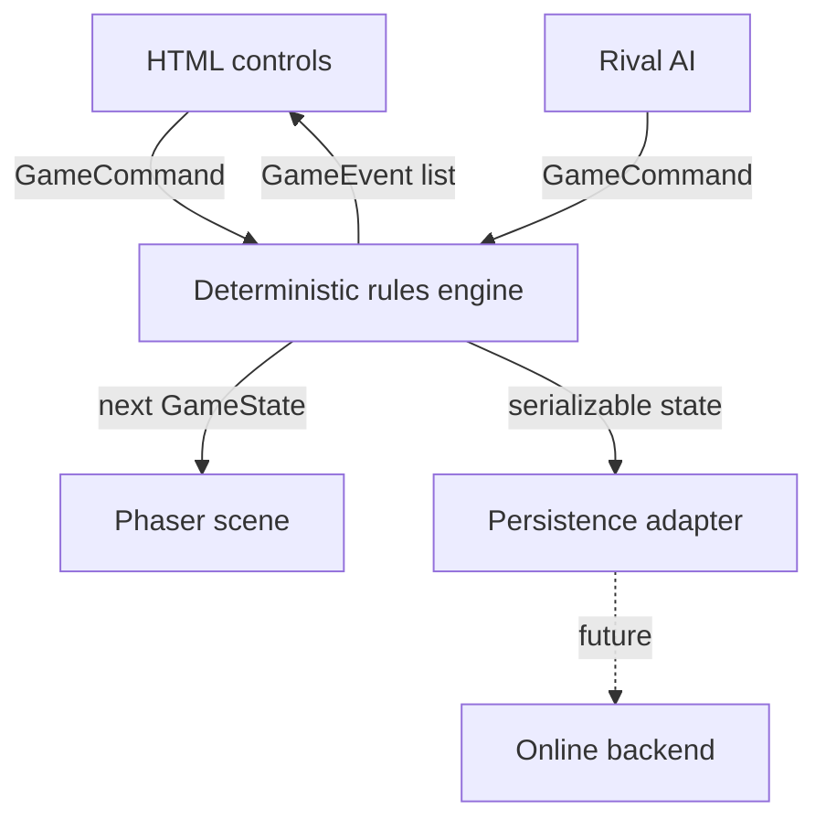

# Architecture

## Core principle

Game rules never depend on Phaser, the DOM, local storage or a network. `GameState` is plain JSON-compatible data. Each player action is a serializable `GameCommand`; `applyCommand` validates that command and returns either an unchanged state with an error or a new state with domain events.

This makes a local match, replay, hot-seat handoff and future server validation different transports around the same rules.

## State and commands

`src/game/types.ts` defines the complete versioned state and command union. Important invariants include:

- axial coordinates are `{q, r}`;
- every random decision advances the stored `rngState`;
- the map seed and command sequence fully determine the result;
- defeated armies remain serializable but are ignored by rules and rendering;
- visibility is derived from armies and settlements, while discovery persists;
- front-end events describe outcomes but never become authoritative state.

Implemented command types:

- `MOVE_ARMY` — moves one adjacent step or resolves combat against an occupant;
- `RANGED_ATTACK` — lets a ranger strike within two hexes without retaliation;
- `FOUND_SETTLEMENT` and `FOUND_OUTPOST` — create territory centers;
- `QUEUE_CONSTRUCTION` — queues a building or troop group;
- `CHOOSE_DISCOVERY` — selects one valid research target;
- `CAST_SPELL` — applies a validated map effect;
- `INTERACT_WITH_SITE` — resolves a world site and its reward;
- `END_TURN` — processes economy, growth, construction, research, healing, visibility, monsters and victory.

`applyCommand` clones before mutation. A rejected command returns the original object, so UI mistakes cannot partially corrupt the game.

## Determinism

`SeededRng` is a small Mulberry32-style generator whose state is a 32-bit integer. Map generation and combat use only this generator. No rule calls `Math.random`, reads the clock or depends on render frame timing.

The AI also submits ordinary commands. It may choose targets heuristically, but every executed action goes through `applyCommand`. A future server can therefore run the same validation logic.

## Map and rendering

The world is a 12×10 axial-coordinate parallelogram. `axialToWorld` maps each coordinate to a pointy-top 2D position. Phaser renders each tile as a raised top polygon plus shaded side faces; small procedural terrain markers and miniatures preserve map readability without coupling asset IDs to the rules.

Rendering consumes only a state snapshot. It never changes resources, movement, fog, combat or turn order. Selection is transient UI state and is not persisted.

## Economy and progression

Settlement population determines how many nearest radius-one tiles are worked automatically. This intentionally removes citizen micromanagement. Food is stored for growth; resource income enters the player pool; construction advances from fixed settlement production; research invests at most six stored knowledge per turn.

Data definitions in `src/game/data.ts` contain terrain yields, movement, units, buildings, discoveries and spells. Balancing usually changes data, not command validation.

## Persistence

`GamePersistence` is the adapter boundary. `LocalGamePersistence` stores versioned snapshots under namespaced local-storage keys. Export wraps a snapshot in readable JSON; import validates the essential schema before accepting it.

Online storage should implement `MultiplayerBackend` from `src/game/multiplayer.ts`. The interface uses versioned snapshots and expected-version command submission to support optimistic concurrency.

## Test strategy

Vitest covers:

- repeatable PRNG sequences;
- byte-equivalent maps for identical seeds;
- different maps for different seeds;
- rejected-command immutability;
- identical command-sequence replay;
- settlement founding and costs;
- 30-round termination and scoring;
- save export/import and incompatible-format rejection.

Renderer behavior is intentionally thin. High-value game invariants are tested without a browser or GPU.
