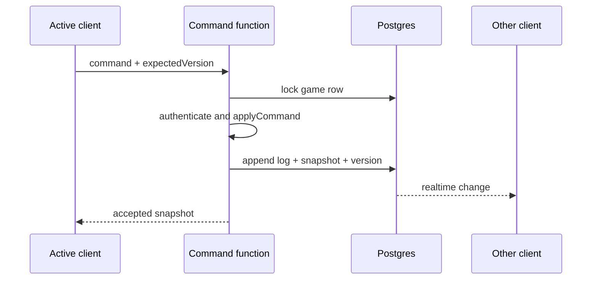

# Asynchronous online multiplayer

The vertical slice is local-first. No Supabase project, credentials or privileged service is created. This document defines the next layer without weakening the deterministic core.

## Authority model

Clients submit commands, never replacement snapshots. A trusted Edge Function or server process should:

1. authenticate the caller;
2. load the current game and membership;
3. verify turn ownership and expected state version;
4. validate the command with the deterministic engine;
5. atomically append command/events and update the snapshot/version;
6. notify subscribed clients.

A stale `expectedVersion` returns a conflict and the latest snapshot. The client refreshes instead of silently overwriting another turn.

## Proposed records

- `games`: ID, creator, map seed, current validated snapshot, current player/turn, state version and status;
- `game_players`: game ID, authenticated user, player slot and turn order;
- `game_commands`: ordered append-only command and event log with actor and resulting version.

See `supabase-schema.sql` for a starting schema and row-level-security policies.

## Security boundaries

- Browser code contains only the public Supabase URL and anonymous key.
- Row Level Security allows participants to read their games.
- Direct client updates to authoritative snapshots and command logs are denied.
- Only the validation function uses service-role access.
- Membership, turn owner, version and command legality are all verified server-side.
- Invite tokens should be short-lived, hashed at rest and separate from game IDs.

RLS is a seatbelt, not the driver: it restricts row access, but the command function still has to validate game rules.

## Adapter implementation order

1. Extract the pure engine into a shared package usable by browser and Edge Function.
2. Create Supabase tables and enable the policies in the schema proposal.
3. Implement `createGame`, `getGame` and `submitCommand` from `MultiplayerBackend`.
4. Add command-log replay tests comparing server and client snapshots.
5. Add invitation/authentication UI.
6. Subscribe to version changes for notifications, not as the authority mechanism.
7. Add reconnect, stale-version and abandoned-game flows.
8. Add snapshot compaction while retaining a bounded audit log.

## Compatibility

`GameState.version` is currently `1`. Any future state change should add an explicit migration. Matches should record the engine ruleset version so a balance patch cannot reinterpret an in-progress command log.

